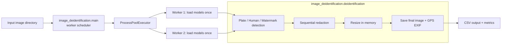

# Road-Survey Image De-identification

Automated de-identification pipeline for road-survey imagery. The tool detects and redacts
personally-identifiable content — **licence plates**, **persons**, and **embedded watermarks** —
captured during road-survey / road-defect inspection runs.
The pipeline is the `image_deidentification` Python package (under `src/`) and can be driven
from the CLI, a config file, or a Docker container.

The current workflow is:

`decode image` -> `extract GPS-only EXIF metadata` -> `parallel plate / human / watermark detection` -> `sequential redaction` -> `resize in memory` -> `save final image once with preserved GPS metadata`


```mermaid
flowchart LR
    A[Input image directory] --> B[image_deidentification.main
worker scheduler]
    B --> C[ProcessPoolExecutor]
    C --> D[Worker 1: load models once]
    C --> E[Worker 2: load models once]
    D --> F[Plate / Human / Watermark detection]
    E --> F
    F --> G[Sequential redaction]
    G --> H[Resize in memory]
    H --> I[Save final image + GPS EXIF]
    I --> J[CSV output + metrics]

    subgraph App[image_deidentification.deidentification]
        F
        G
        H
        I
    end
```

The main entrypoint is [src/image_deidentification/main.py](src/image_deidentification/main.py), installed as the `image-deidentification` command. It loads enabled models once per worker process, processes images in parallel, and avoids writing intermediate masked images to disk unless the caller explicitly uses a temporary debug directory structure.

## Requirements

- Python 3.12+
- OpenCV, PyTorch, torchvision, ultralytics, EasyOCR, and Pillow (pinned in `pyproject.toml`, locked in `requirements.lock`)
- CUDA-capable GPU is optional; the pipeline falls back to CPU automatically
- The YOLO plate model is expected at `models/license_plate_detector.pt`. **Model weights are downloaded, not bundled**: they are not in Git or in the Python package — fetch them with `scripts/download_models.py` (see below)

## Setup

1. Create and activate a virtual environment:

```bash
python3 -m venv .venv
source .venv/bin/activate
```

2. Install the locked dependencies and the package. The lock file pulls CPU-only
   `torch`/`torchvision` from `https://download.pytorch.org/whl/cpu`:

```bash
pip install -r requirements.lock
pip install --no-deps -e .
```

   For development (tests, linters, pre-commit) use `requirements-dev.lock` instead,
   then `pre-commit install`.

   With a CUDA GPU, install `torch`/`torchvision` from the matching PyTorch index
   first, then `pip install -e .`.

3. Download model weights:

Large model binaries are stored outside Git as GitHub Release assets. Fetch and verify them
(SHA-256 checked) into `models/` by running:

```bash
python scripts/download_models.py
```

Or using the shell wrapper:

```bash
./scripts/download_models.sh
```

During Docker builds, weights are automatically downloaded and verified at build time.

## Configuration

The pipeline reads settings from `pipeline_config.json` and supports command-line overrides.
Relative paths in the config and on the command line resolve against the current working
directory (`/app` inside the container). Configs that still point `weights` at the old
`app/sensitive_data_masking/` location fall back to `models/`.

Example config keys:

- `input_dir`, `output_dir`, `temp_dir`
- `weights`, `device`, `mask_mode`
- `ocr`, `ocr_langs`
- `conf`, `imgsz`, `high_thresh`, `low_thresh`
- `ext`
- `exif_strip`, `watermark_removal`, `human_mask`, `plate_mask`, `resizing`
- `workers`, `max_gpu_workers`, `worker_start_method`, `log_file`

A typical config is:

```json
{
  "input_dir": "train/images",
  "output_dir": "outputs/final",
  "temp_dir": "outputs/temp",
  "weights": "models/license_plate_detector.pt",
  "device": "auto",
  "mask_mode": "black",
  "ocr": false,
  "ocr_langs": "en",
  "conf": 0.1,
  "imgsz": 640,
  "high_thresh": 500.0,
  "low_thresh": 100.0,
  "ext": "jpg,jpeg,png,bmp,tif,tiff,webp",
  "exif_strip": true,
  "watermark_removal": true,
  "human_mask": true,
  "plate_mask": true,
  "resizing": true,
  "workers": 0,
  "max_gpu_workers": 1,
  "worker_start_method": "spawn",
  "log_file": ""
}
```

## Current package-based pipeline

The reusable API lives in [src/image_deidentification/deidentification/__init__.py](src/image_deidentification/deidentification/__init__.py). The package exports the main detection, redaction, resize, and EXIF helpers:

```python
from image_deidentification.deidentification import (
    detect_human_mask,
    detect_plate_boxes,
    detect_watermark_regions,
    redact_human_mask,
    redact_plate_boxes,
    redact_watermark_regions,
    resize_for_quality,
    extract_geo_exif,
    save_with_geo_exif,
)
```

The implementation is split into stage modules:

- [deidentification/plate_stage.py](src/image_deidentification/deidentification/plate_stage.py): YOLO plate detection and redaction
- [deidentification/deeplab_stage.py](src/image_deidentification/deidentification/deeplab_stage.py): DeepLab human segmentation and masking
- [deidentification/watermark_stage.py](src/image_deidentification/deidentification/watermark_stage.py): EasyOCR-based watermark detection and redaction
- [deidentification/exif_stage.py](src/image_deidentification/deidentification/exif_stage.py): GPS-only EXIF extraction and final save with metadata preservation
- [deidentification/resize_stage.py](src/image_deidentification/deidentification/resize_stage.py): optional resize step before final save

Per image, the pipeline now follows this order:

1. Read the image
2. Extract only GPS/geo EXIF metadata if enabled
3. Run enabled detections in parallel
4. Apply redactions sequentially
5. Resize in memory if enabled
6. Save the final anonymized image once, preserving the captured EXIF metadata

## Parallel detection and worker processes

The orchestration in [main.py](src/image_deidentification/main.py) runs one task per image over a ProcessPoolExecutor.

Behavior:

- `workers: 0` uses a default worker count of 2 unless GPU mode is enabled
- `max_gpu_workers` caps process count on CUDA
- `worker_start_method` is configurable and defaults to `spawn`
- logs are saved to `temp_dir/pipeline.log` by default; set `log_file` or use `--log-file` to choose another path
- each worker initializes the enabled models once and reuses them for all images in that process
- EasyOCR is shared per worker to avoid reloading it for every image
- queue activity is logged for task submission, worker start, completion, and failure
- queue snapshots include submitted, waiting, running, completed, and failed job counts
- detection timings are recorded per stage, as well as model-load timing and end-to-end detection wall time

The pipeline records:

- plate detection time
- human detection time
- watermark detection time
- total detection wall time
- plate redaction time
- human redaction time
- watermark redaction time
- EXIF extraction time
- save time
- model-load time for YOLO, DeepLab, and EasyOCR
- parent-process peak RSS memory
- sum of worker-process peak RSS memory
- total system RAM and sampled peak system RAM used
- CUDA peak allocated and reserved memory when CUDA is active
- virtual-memory total, used, available, and percentage
- logical CPU count, physical core count, CPU affinity, peak system CPU usage, and configured worker count

Memory values are reported in the terminal and in the run log. Worker RAM is measured per worker and summed across workers; this is a sum of individual worker peaks, not necessarily a single instantaneous total. System and worker aggregate values are sampled while the pool is running, so very short-lived spikes may not be captured by the parent sampler.

Queue log entries use `waiting` for submitted jobs that have not started, `running` for started jobs that have not finished, and `completed`/`failed` for finished jobs. Since all image tasks are currently submitted eagerly, the initial waiting count can grow to nearly the number of input images before workers begin consuming it.

## Running the full pipeline

```bash
image-deidentification --config pipeline_config.json
# equivalent: python -m image_deidentification --config pipeline_config.json
```

To choose a custom log path:

```bash
image-deidentification --config pipeline_config.json --workers 2 --log-file outputs/pipeline.log
```

Optional CLI overrides:

```bash
image-deidentification \
  --config pipeline_config.json \
  --input-dir train/images \
  --output-dir outputs/final \
  --temp-dir outputs/temp \
  --device auto \
  --mask-mode black \
  --conf 0.1 \
  --imgsz 640 \
  --ocr \
  --exif-strip \
  --watermark-removal \
  --human-mask \
  --plate-mask \
  --resizing
```

## Output behavior

- Final anonymized images are written to `output_dir`
- A CSV of detected plate text is written to `temp_dir/plate_results.csv`
- A persistent run log is written to `temp_dir/pipeline.log` by default
- EXIF metadata is preserved only for GPS/geo tags before the final save step
- Intermediate stage images are not normally written to disk as part of the main package pipeline

## Running tests

```bash
pip install -r requirements-dev.lock
pip install --no-deps -e .
ruff check . && black --check .
pytest --cov
```

The tests do not need model weights or network access. CI runs the same steps on every
pull request (`.github/workflows/ci.yml`).

## Docker

Build the image. The build downloads and verifies the plate model from the GitHub
Release given by `PLATE_MODEL_URL` (override with `--build-arg`), and pre-caches the
EasyOCR and DeepLab weights so the container needs no network at run time:

```bash
docker build -t skald-image .
```

The image entrypoint is `image-deidentification`; arguments after the image name replace the
default `--config /app/config/pipeline_config.json`. Run it against the standard mount layout:

```bash
docker run --rm \
  -v $(pwd)/train/images:/app/data:ro \
  -v $(pwd)/config:/app/config:ro \
  -v $(pwd)/outputs:/app/output \
  skald-image
```

The container runs as root on purpose: the TEE bind-mounts host directories at
`/app/output` and must be able to write there regardless of host ownership.

## Docker Compose

Start the stack:

```bash
docker compose up --build
```

Run the pipeline inside the compose service:

```bash
docker compose run --rm skald-image --workers 2
```

## Project structure

```text
Image-deidentification/
├── src/image_deidentification/
│   ├── __init__.py               # __version__
│   ├── __main__.py               # python -m image_deidentification
│   ├── main.py                   # CLI entry point and worker scheduler
│   ├── deidentification/        # stage modules used by the pipeline
│   │   ├── contracts.py
│   │   ├── deeplab_stage.py
│   │   ├── exif_stage.py
│   │   ├── plate_stage.py
│   │   ├── resize_stage.py
│   │   └── watermark_stage.py
│   ├── exif_geo_tag/
│   ├── sensitive_data_masking/
│   ├── watermark_removal/
│   └── resizing.py
├── tests/
├── scripts/
│   ├── download_models.py        # fetch + SHA-256 verify model weights
│   └── download_models.sh
├── models/                       # gitignored; filled by scripts/download_models.py
├── config/pipeline_config.json   # container default config
├── pipeline_config.json          # local default config
├── pyproject.toml
├── requirements.lock             # runtime lock (pip-compile)
├── requirements-dev.lock         # runtime + dev tools lock
├── Dockerfile
└── docker-compose.yml            # local build/test only
```

## Notes

- The main workflow is package-based and in-memory; it is not the older multi-step script chain.
- EasyOCR is the active OCR engine for watermark detection.
- Plate detection uses Ultralytics YOLO, and human masking uses torchvision DeepLabV3.
- The project preserves only the geo/GPS EXIF footprint before the final save so sensitive metadata is stripped while location data remains available when needed.

## Contributing and security

See [CONTRIBUTING.md](CONTRIBUTING.md) and [SECURITY.md](SECURITY.md). Changes are recorded in
[CHANGELOG.md](CHANGELOG.md).

## License

Apache-2.0 — see [LICENSE](LICENSE).
